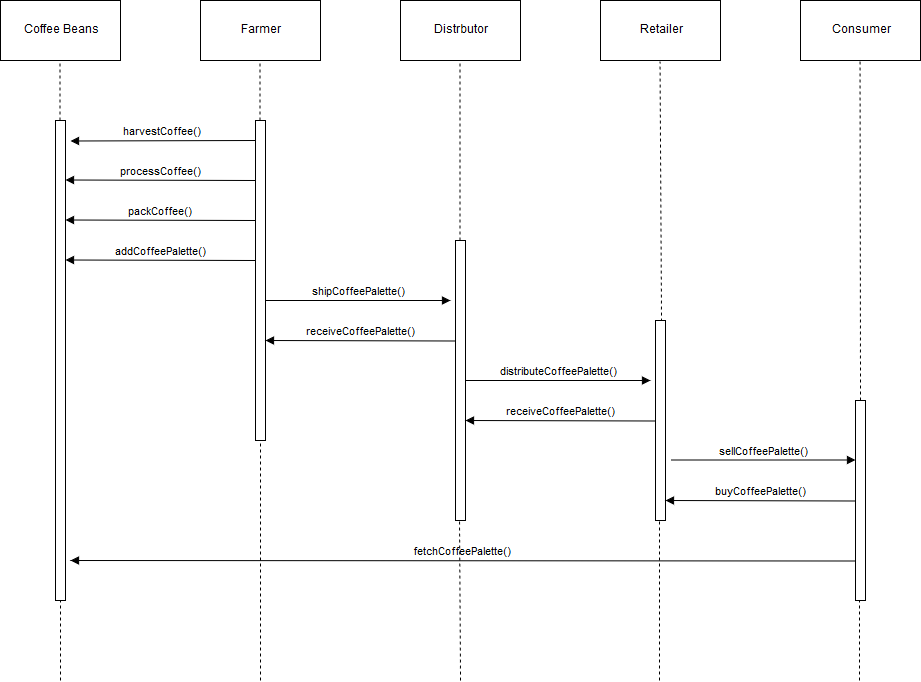
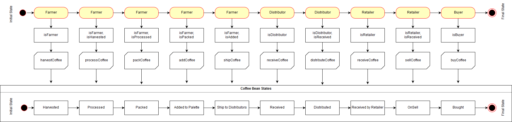
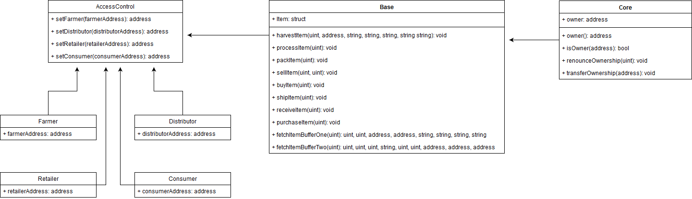

# Fair Trade Coffee

Fair Trade Coffee is a Decentralized Application built on Ethereum platform, to demonstrate the use of blockchain in supply chain of coffee. There are four roles in this supply chain: Farmer, Distributor, Retailer and Consumer. Each role performs different task on supply chain.

# Features
- Farmer inputs upc, farm Details, and product Notes to harvest a coffee beans.
- Farmer processes the coffee beans.
- Farmer packs coffee beans.
- Farmer put coffee on sell. By default, price is 1 ether.
- Distrbutor buy coffee from farmer.
- Distributor ships coffee to retailer.
- Retailer marks item as received.
- Consumer purchase item from retailer.
- Authenticity of coffee beans can be tracked.

# Tech
Star Notary Service was developed by using a following library:
- [Node.js](https://nodejs.org/en/) 10.16.0
- Truffle v5.0.2
- Truffle-hdwallet-provider v1.0.13
- Web3 v1.0.0-beta.37
- IPFS. This App currently not using IPFS. In the future, IPFS can be used to store image of each item in harvesting process.
  
# UML

## Activity Diagram


## Sequence Diagram



## State Diagram



## Class Diagram



# Contract Information
The contract was deployed to rinkeby testnet

- Transaction Hash: [0x46701824d9fc4eebf0246d55fe8dd302b2bc99a8d0785b778b445193c8ad4411](https://rinkeby.etherscan.io/tx/0x46701824d9fc4eebf0246d55fe8dd302b2bc99a8d0785b778b445193c8ad4411)
- Contract Address: [0x93EDE7c6Ac156ECE7A65f6Ef98677507748fAD9b](https://rinkeby.etherscan.io/address/0x93ede7c6ac156ece7a65f6ef98677507748fad9b)

# Execution
After download the application, download neccessary node modules:
```sh
npm install
```
then activate the local server:
```sh
npm run dev
```
From web browser, go to [http://localhost:3000/](http://localhost:3000/) to interact with the front-end.